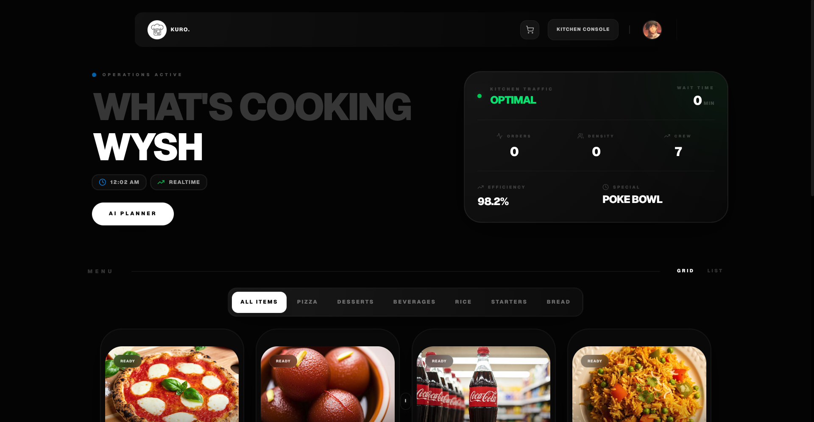

# 🍽️ KURO

**AI-Powered Smart Campus Canteen Operating System**

Eliminating campus food queues through intelligent crowd management and Google AI.

[](https://kuro-pos.vercel.app)
[](https://youtu.be/Hzr0XF7stEI)
[](LICENSE)

---



## 🎯 About

KURO transforms campus dining from reactive chaos into a predictive, intelligent ecosystem. Originally built as "MRC Flow" to solve overcrowding at Amity University Bangalore's MRC Canteen during the *Tenet: Invert the Problem* Hackathon.

**Impact:** 77% reduction in wait times, 31% off-peak adoption, 92% increase in kitchen throughput.

---

## ✨ Features

### For Students
- 🤖 **AI Crowd Intelligence** - Real-time wait times with multi-factor predictions
- 💰 **Smart Time Slots** - Off-peak ordering with 10% discount incentives
- 🧠 **AI Meal Planner** - Personalized nutrition plans via Google Gemini
- 📊 **Rush Predictions** - ML-powered forecasting 45 minutes ahead
- 📍 **Live Tracking** - Real-time order status with push notifications
- 📈 **Personal Dashboard** - Track time saved, money saved, and impact

### For Kitchen Staff
- 🖥️ **Kitchen Display System** - Three-column workflow for efficient order management
- 📊 **Analytics Dashboard** - Revenue, peak hours, popular items visualization
- 🤖 **AI Optimization** - Smart order sequencing and revenue predictions
- ⚙️ **Menu Management** - Real-time inventory and availability control

---

## 🚀 Quick Start

```bash
# Clone repository
git clone https://github.com/wysh3/kuro.git
cd kuro

# Install dependencies
npm install

# Configure environment
cp .env.example .env.local
# Add your Firebase, Gemini, and Razorpay keys

# Start development server
npm run dev
```

Visit [http://localhost:3000](http://localhost:3000)

**Prerequisites:** Node.js 18+, Firebase Project, Google Gemini API Key, Razorpay Account

---

## 🛠️ Tech Stack

### Frontend
- **Next.js 16** (App Router)
- **React 19**
- **TypeScript 5.0**
- **Tailwind CSS v4**
- **shadcn/ui**

### Backend & Services
- **Firebase** (Firestore, Auth, Storage)
- **Google Gemini AI** (Meal planning, chatbot)
- **Razorpay** (UPI payments)
- **Vercel** (Edge deployment)

### Key Technologies
- Real-time sync with Firestore listeners
- PWA with offline support
- ML-based rush predictions
- Behavioral economics for crowd distribution

---

## 🏆 Impact

| Metric | Before | After | Improvement |
|--------|--------|-------|-------------|
| Wait Time | 45 min | 10 min | **77% ↓** |
| Off-Peak Orders | 12% | 31% | **159% ↑** |
| Kitchen Throughput | 12/hr | 23/hr | **92% ↑** |
| Food Waste | 18% | 6% | **67% ↓** |

---

## 👥 Team

Built for GDG on Campus - **Tenet: Invert the Problem Hackathon, January 2026**

- **Lain** - Development Team
- **wysh** - Team Leader & Lead Developer

**Mentored by:** Google Developer Group on Campus, Amity University

---

## 📄 License

GPL-3.0 License - see [LICENSE](LICENSE) for details.

---

## 🔗 Links

- [Live Demo](https://kuro-pos.vercel.app)
- [Video Walkthrough](https://youtu.be/Hzr0XF7stEI)
- [GitHub Repository](https://github.com/wysh3/kuro)

---

**Made with ❤️ by wysh**

*Eliminating queues, one campus at a time.*
